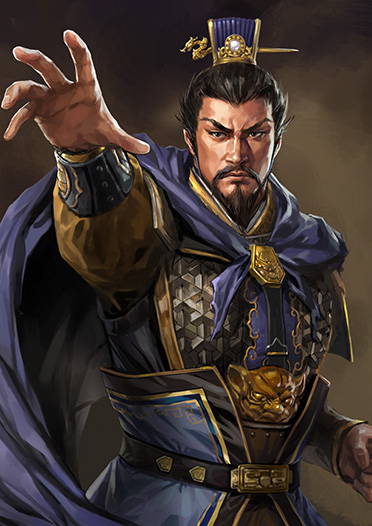

# caocao-chat

  
&nbsp;

  

  

### 项目简介

曹操-Chat是一个基于《三国演义》剧本中曹操的台词和语句，以及使用InternLM进行QLoRA微调得到的模仿曹操语气的聊天语言模型。用户可以通过模型与曹操-Chat进行对话。

### 设备要求

- CPU：Intel Core i5 或以上
- GPU：(1/4) NVIDIA A100 或以上
- 内存：32GB 或以上
- 存储：至少50GB可用空间
